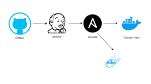

# Ansible Jenkins Docker Project

## Overview

The Ansible Jenkins Docker project is a comprehensive solution for automating the deployment process of web applications. It combines the power of Ansible for configuration management, Jenkins for continuous integration and deployment, and Docker for containerization. Additionally, Terraform is used to provision the underlying infrastructure, including VPC, EC2 instances for Jenkins and Docker, and their respective security groups.

## Features

- **Automated Deployment:** Ansible playbooks automate the deployment process, ensuring consistency and reliability.
- **Continuous Integration:** Jenkins pipelines enable continuous integration, allowing for automated testing and deployment upon code changes.
- **Containerization:** Docker is utilized to package applications and their dependencies into isolated containers, ensuring consistent deployment across environments.
- **Infrastructure as Code:** Terraform scripts provision the necessary infrastructure components, ensuring scalability, maintainability, and reproducibility.

## Prerequisites

- Ansible installed on the deployment server.
- Jenkins installed and configured for pipeline execution.
- Docker installed on both deployment and target servers.
- Terraform installed locally for infrastructure provisioning.

## Directory Structure

- `ansible-palybooks/`: Contains Ansible playbooks and configuration files.
- `jenkinsfile`: Jenkinsfile for pipeline execution.
- `infra/`: Terraform configuration files for infrastructure provisioning.
